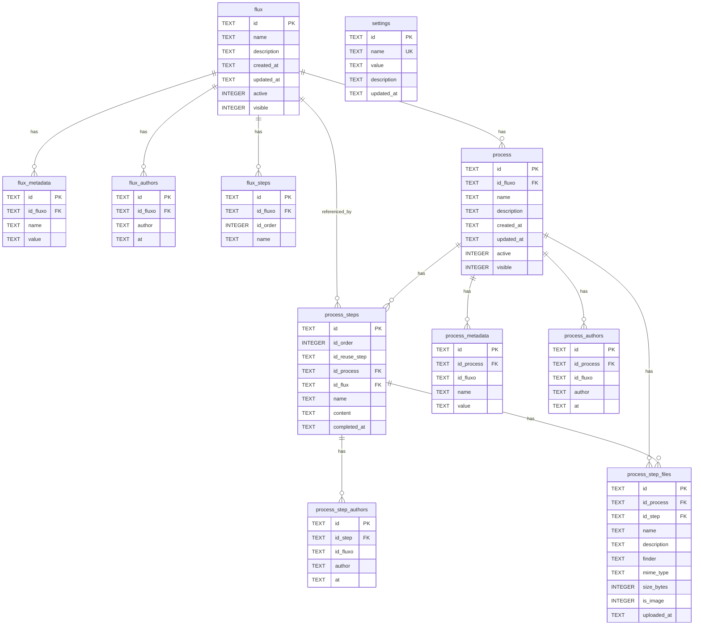
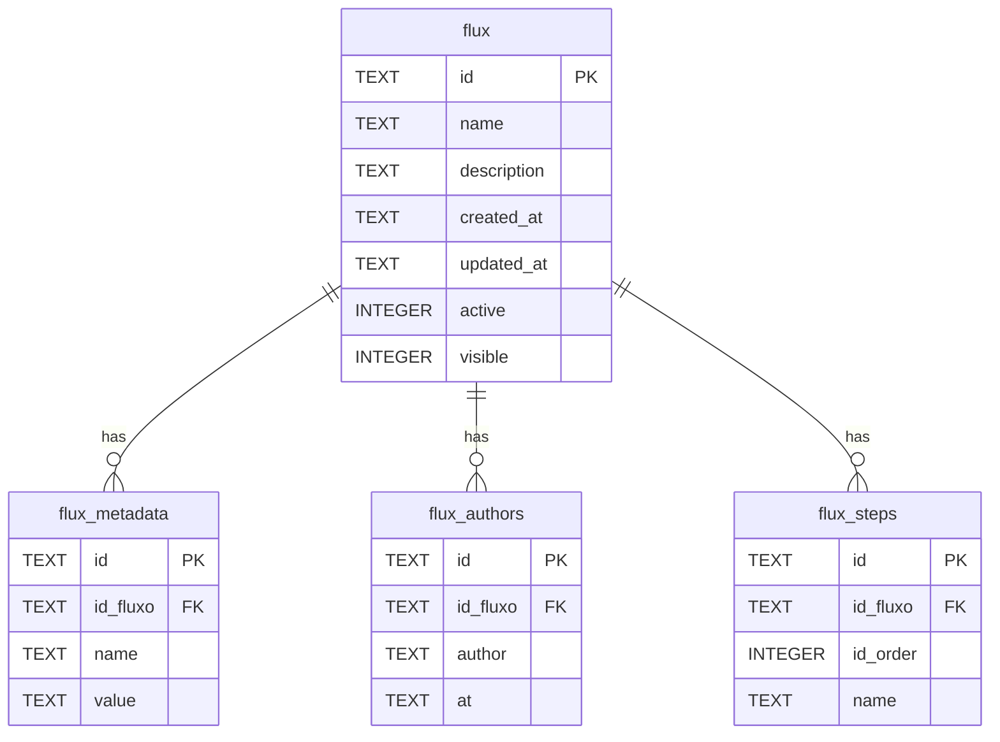
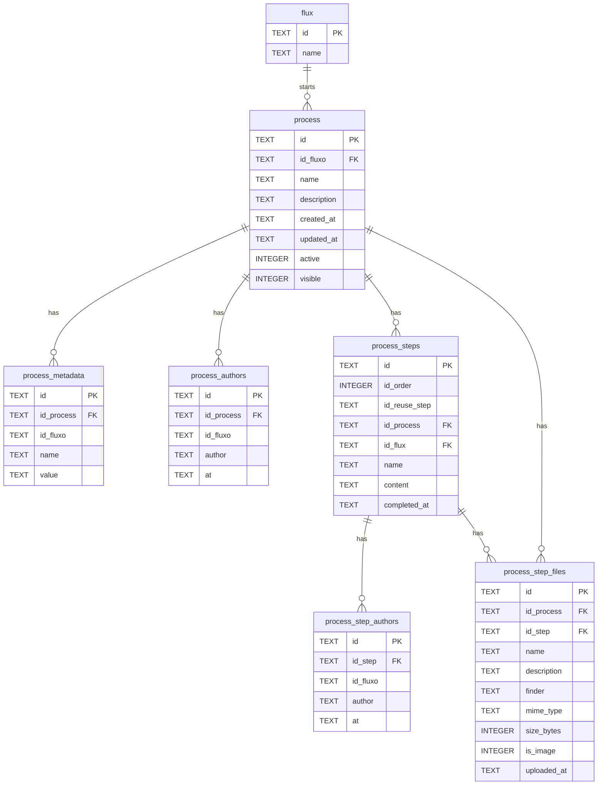
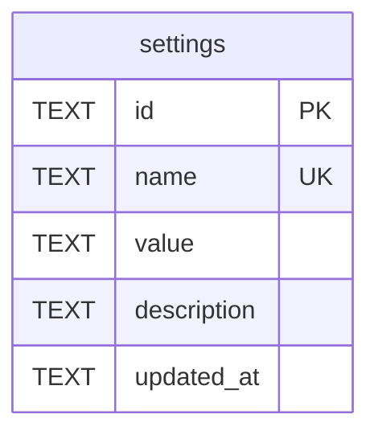

# schema.md

Diagrama Mermaid do banco de dados gerado a partir de [`schema.sql`](./schema.sql).

> Mantenha este arquivo em sincronia com `schema.sql`. Toda alteração de tabela/coluna deve ser refletida aqui (regra do `AGENTS.md`).

## Visão geral (ER)

## Domínio Flux (Fluxos)

## Domínio Process (Processos)

## Settings (Configuração)

## Convenções

- Todos os PKs (`id`) são gerados via [`src/front/lib/randomHEX.ts`](./src/front/lib/randomHEX.ts) com 16 bytes (string hex).
- Colunas de data (`created_at`, `updated_at`, `at`) usam `datetime('now')` do SQLite.
- Soft delete via `active = 0`. A coluna `visible` controla se a linha aparece em listagens públicas.
- Calendário (heatmap de "fluxos iniciados") consulta `process.created_at` agrupado por dia — não há tabela dedicada.
- Wizard de processo: `process_steps.completed_at` (NULL = pendente). O passo atual é o primeiro com `completed_at IS NULL` ordenado por `id_order`. Passos concluídos são read-only (podem ser reabertos com a action `reopenStep`).

## Índices criados

- `flux`: `idx_flux_name`, `idx_flux_active`, `idx_flux_created`
- `flux_metadata`: `idx_flux_metadata_flux`
- `flux_authors`: `idx_flux_authors_flux`
- `flux_steps`: `idx_flux_steps_flux`
- `process`: `idx_process_flux`, `idx_process_name`, `idx_process_active`, `idx_process_created`
- `process_metadata`: `idx_process_metadata_process`
- `process_authors`: `idx_process_authors_process`
- `process_steps`: `idx_process_steps_process`, `idx_process_steps_flux`
- `process_step_authors`: `idx_process_step_authors_step`
- `process_step_files`: `idx_process_step_files_step`
